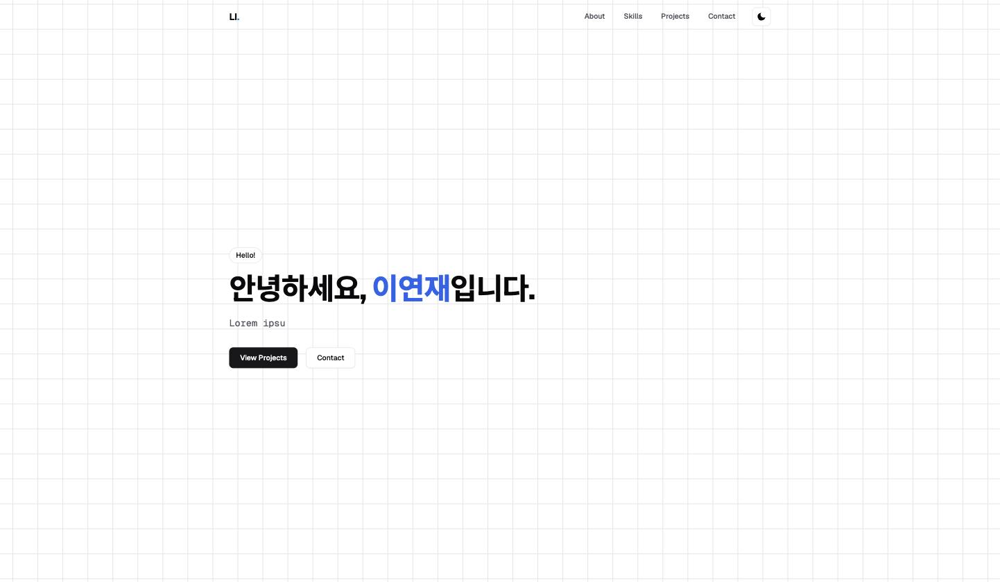
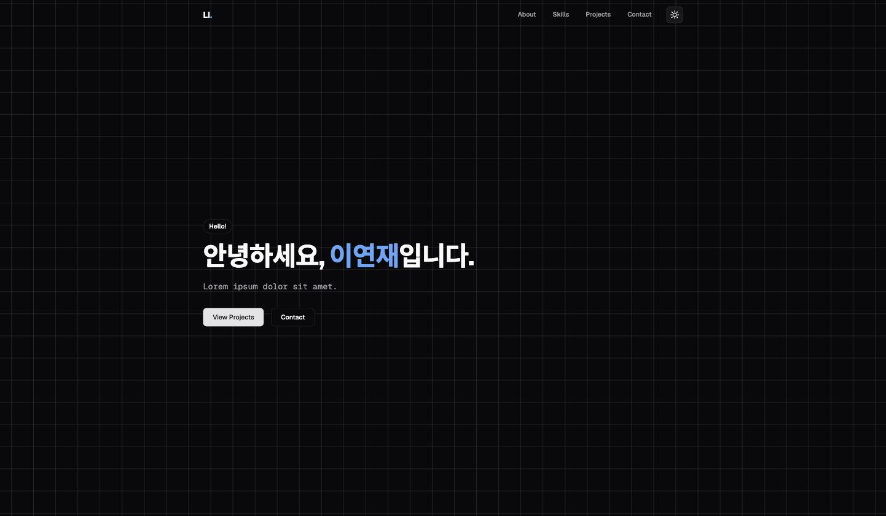
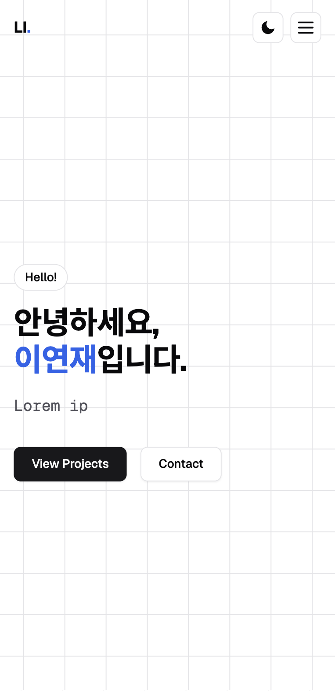

# 나를 소개하는 웹페이지

외부 라이브러리 없이 순수 HTML/CSS/JavaScript만으로 만든 반응형 포트폴리오 웹사이트입니다.
Codyssey B1-1 과제("나를 소개하는 웹페이지 처음부터 만들기")의 결과물입니다.

**배포 URL: <https://eajnoeyeel.github.io/B1-1/>**

## 스크린샷

| 데스크톱 (라이트) | 데스크톱 (다크) | 모바일 |
| --- | --- | --- |
|  |  |  |

## 사용 기술

- HTML5 (시맨틱 마크업)
- CSS3 (CSS 변수, Flexbox, Grid, 미디어 쿼리 기반 반응형)
- Vanilla JavaScript (ES6+, `fetch`/`async-await`, DOM 이벤트)
- [GitHub REST API](https://docs.github.com/en/rest) — Projects 섹션의 저장소 목록 연동
- [Formspree](https://formspree.io) — Contact 폼 실전송 (선택, 미설정 시 데모 모드)
- Google Fonts (Geist, Geist Mono, Noto Sans KR)

프레임워크·빌드 도구 없이 정적 파일만으로 동작하며, GitHub Pages로 배포되어 있습니다.

## 주요 기능

- **반응형 레이아웃**: 모바일 퍼스트로 작성, 768px/1024px 브레이크포인트로 태블릿·데스크톱 대응
- **다크 모드**: 토글 버튼으로 전환, 로컬스토리지에 저장되어 새로고침 후에도 유지. 사용자가 직접 고른 적이 없으면 시스템(`prefers-color-scheme`) 설정을 따라감
- **햄버거 메뉴**: 모바일 너비에서 네비게이션이 숨겨지고 토글 메뉴로 전환
- **부드러운 스크롤 / 스크롤 탑 버튼 / 스크롤에 따른 네비게이션 배경 변경**
- **스크롤 애니메이션**: Intersection Observer로 섹션이 뷰포트에 들어올 때 페이드인
- **GitHub API 연동**: Projects 섹션에서 본인 저장소 목록을 가져와 카드로 렌더링. 로딩/성공/빈/에러(레이트 리밋 포함) 상태를 모두 UI로 표현하고, 에러 시 재시도 버튼 제공
- **폼 유효성 검사**: 이름/이메일/메시지 필수값 검증, 이메일 형식 검증, 필드 근처 에러 메시지 표시
- **보너스 4종**: 언어별 프로젝트 필터(`array.filter`), Hero 타이핑 효과, Formspree 실전송 연동, 시스템 다크 모드 감지

## 설계 노트

### 이벤트 → 상태 → 렌더링

모든 기능은 **사용자 이벤트가 `state`를 바꾸고, 대응하는 `render*()` 함수가 그 `state`만 보고 화면을 다시 그리는** 한 방향 흐름으로 구현했습니다. DOM을 직접 고쳐 쓰는 곳은 없습니다.

| 흐름 | 이벤트 | 상태 변경 | 렌더링 |
| --- | --- | --- | --- |
| 다크 모드 | 토글 클릭 | `state.theme` | `renderTheme()` → `data-theme` 속성 교체 |
| 프로젝트 | 페이지 로드 / 재시도 클릭 | `state.projects.status` (`loading`→`success`/`empty`/`error`) | `renderProjects()` |
| 폼 | 입력 / 포커스 아웃 / 제출 | `state.form.errors`, `state.form.status` | `renderFormErrors()`, `renderFormStatus()` |
| 필터 | 언어 버튼 클릭 | `state.filter` | `renderProjectsSection()` |

### Flexbox와 Grid 선택 기준

- **네비게이션은 Flexbox**: 로고와 메뉴를 한 축(가로)에 놓고 남는 공간을 분배하는 1차원 배치라서 `justify-content`만으로 의도가 그대로 표현됩니다.
- **프로젝트 카드는 Grid**: 카드 개수가 API 응답에 따라 달라지므로, `repeat(auto-fit, minmax(280px, 1fr))`로 **열 개수를 브라우저가 너비에 맞춰 정하게** 했습니다. 미디어 쿼리를 추가하지 않아도 화면 크기에 따라 1~3열로 자동 변합니다.

### map / filter 사용 의도

- `map`: GitHub API의 저장소 객체 배열을 **카드 HTML 문자열 배열로 1:1 변환**할 때 사용합니다 (`items.map(projectCard).join('')`). 원본 배열을 건드리지 않아 필터를 바꿔도 다시 그리기만 하면 됩니다.
- `filter`: 응답에서 **포크·보관된 저장소를 제외**할 때, 그리고 **선택한 언어의 저장소만 추릴 때** 사용합니다. 원본(`state.projects.items`)은 그대로 두고 화면에 보일 목록만 매번 새로 계산하므로, "All"로 되돌리면 재요청 없이 복원됩니다.

## 설정값 (`js/main.js` 상단 `CONFIG`)

| 항목 | 값 | 설명 |
| --- | --- | --- |
| `navScrollThreshold` | `60px` | 이 값 이상 스크롤하면 네비게이션 배경이 바뀜 |
| `scrollTopThreshold` | `300px` | 이 값 이상 스크롤하면 스크롤 탑 버튼이 나타남 |
| `revealThreshold` | `0.2` | 스크롤 애니메이션(Intersection Observer) 임계값 |
| `fetchTimeout` | `8000ms` | GitHub API 응답 대기 한도. 초과 시 `AbortController`로 요청을 취소하고 에러 상태로 전환 |
| `githubUser` | `eajnoeyeel` | GitHub API로 저장소 목록을 가져올 사용자 |
| `formspreeId` | `xdekanev` | Formspree 폼 ID. 비우면 실제 전송 없이 데모 모드로 동작 |

테마 저장이 막힌 환경(시크릿 모드, 쿠키 차단 등)에서는 `safeStorage`가 예외를 삼킵니다. 이때 **현재 세션의 테마 전환은 정상 동작**하고, 새로고침하면 시스템 설정값으로 돌아갑니다.

## 로컬 실행

빌드 과정이 없으므로 정적 파일 서버만 있으면 됩니다.

```bash
git clone https://github.com/eajnoeyeel/B1-1.git
cd B1-1
python3 -m http.server 5500   # 또는 VS Code의 Live Server 확장에서 index.html 우클릭 → "Open with Live Server"
```

브라우저에서 <http://localhost:5500> 접속. `file://`로 직접 열면 GitHub API 호출이 CORS로 막히므로 **반드시 서버를 통해** 확인해야 합니다.

배포 확인은 `main` 브랜치에 푸시하면 GitHub Pages가 자동으로 재배포합니다. 빌드 상태는 아래로 확인합니다.

```bash
gh api repos/eajnoeyeel/B1-1/pages/builds/latest --jq '.status, .error.message'
```

## 동작 확인 체크리스트

### 브레이크포인트별 레이아웃

각 너비에서 실제로 측정한 값입니다.

| 너비 | 카드 열 수 | 햄버거 버튼 | 네비게이션 메뉴 | Hero 제목 |
| --- | --- | --- | --- | --- |
| 390px (모바일) | 1열 | 표시 | 드롭다운(`position: absolute`) | 36px |
| 768px (태블릿) | 2열 | 숨김 | 가로 배치(`position: static`) | 48px |
| 1024px (데스크톱) | 3열 | 숨김 | 가로 배치 | 56px |
| 1440px (와이드) | 3열 | 숨김 | 가로 배치 | 56px |

카드 열 수는 미디어 쿼리가 아니라 `repeat(auto-fit, minmax(280px, 1fr))`이 컨테이너 너비에 맞춰 자동으로 정합니다.

### 인터랙션

배포본(<https://eajnoeyeel.github.io/B1-1/>)에서 아래 순서로 확인했습니다.

| 확인 항목 | 방법 | 기대 결과 |
| --- | --- | --- |
| 햄버거 토글 | 모바일 너비에서 버튼 클릭 → 재클릭 | 메뉴가 펼쳐졌다가 닫힘, `aria-expanded`가 `true`/`false`로 바뀜 |
| 부드러운 스크롤 | 네비게이션 `Skills` 클릭 | 해당 섹션으로 부드럽게 이동, 주소창이 `#skills`로 바뀜 |
| 스크롤 탑 버튼 | 300px 이상 스크롤 | 우측 하단 버튼이 나타나고, 클릭 시 맨 위로 이동 |
| 네비게이션 배경 | 60px 이상 스크롤 | 헤더에 반투명 배경과 블러가 적용됨 |
| 다크 모드 유지 | 토글 후 새로고침 | 바뀐 테마가 그대로 유지됨 (localStorage) |
| 폼 검증 | 빈 값으로 제출 | 세 필드 모두 에러 메시지 표시, 첫 에러 필드로 포커스 이동 |
| 폼 제출 | 정상 값 입력 후 제출 | 성공 메시지 표시 후 입력값 초기화 |

### API 에러 상태 재현 방법

Projects 섹션의 에러 UI는 아래 방법으로 재현할 수 있습니다.

- **레이트 리밋(403)**: 인증 없는 GitHub API는 시간당 60회 제한이 있습니다. 짧은 시간에 새로고침을 반복하면 재현되며, 남은 횟수는 `curl -s -I https://api.github.com/users/eajnoeyeel/repos | grep -i x-ratelimit`로 확인합니다.
- **없는 사용자(404)**: `CONFIG.githubUser`를 존재하지 않는 값으로 바꾸면 "GitHub 사용자를 찾을 수 없습니다" 메시지가 표시됩니다.
- **네트워크 단절**: 브라우저 개발자 도구 Network 탭에서 Offline을 선택한 뒤 재시도 버튼을 누릅니다.
- **응답 지연(타임아웃)**: 개발자 도구 콘솔에서 `fetch`를 응답하지 않는 함수로 바꾼 뒤 재시도하면, `fetchTimeout`(8초) 경과 후 요청이 취소되며 "요청 시간이 초과되었습니다" 메시지가 표시됩니다.

어느 경우든 **에러 메시지와 함께 [다시 시도] 버튼**이 표시되고, 버튼을 누르면 로딩 상태부터 다시 시작합니다.

## 접근성 점검

### 색 대비 (WCAG 2.1)

두 테마의 디자인 토큰 조합을 계산해 확인했습니다. 일반 텍스트 기준 AA는 4.5:1입니다.

| 조합 | 라이트 | 다크 |
| --- | --- | --- |
| 본문 텍스트 / 배경 | 19.90:1 (AAA) | 19.06:1 (AAA) |
| 보조 텍스트 / 배경 | 7.73:1 (AAA) | 7.76:1 (AAA) |
| 보조 텍스트 / alt 섹션 배경 | 7.03:1 (AAA) | 7.36:1 (AAA) |
| 링크·강조색 / 배경 | 5.17:1 (AA) | 7.83:1 (AAA) |
| 에러 메시지 / 폼 배경 | 4.83:1 (AA) | 6.40:1 (AA) |
| 성공 메시지 / 폼 배경 | 5.02:1 (AA) | 10.17:1 (AAA) |
| 카드 보조 텍스트 / 카드 배경 | 7.73:1 (AAA) | 6.91:1 (AA) |
| 기본 버튼 텍스트 / 버튼 배경 | 16.97:1 (AAA) | 13.96:1 (AAA) |

점검 과정에서 라이트 모드 두 곳이 AA에 미달해(보조 텍스트 4.40:1, 성공 메시지 3.30:1) 토큰 값을 각각 `zinc-600`, `green-700`으로 낮춰 해결했습니다.

### 키보드 · 스크린리더

- **탭 순서**: `tabindex`를 쓰지 않아 DOM 순서와 일치합니다. 건너뛰기 링크 → 로고 → 테마 토글 → 네비게이션 메뉴 → Hero 버튼 → 필터 → 카드 → 폼 순으로 이동합니다.
- **건너뛰기 링크**: 첫 Tab에 "본문으로 건너뛰기"가 나타나 반복되는 네비게이션을 건너뛸 수 있습니다.
- **폼 에러**: 제출 시 **첫 번째 에러 필드로 포커스가 자동 이동**합니다. 각 입력에는 `aria-invalid="true"`가 설정되고 `aria-describedby`로 에러 문구와 연결되어, 스크린리더가 필드 레이블 직후에 에러 사유를 읽습니다. 에러 영역은 `aria-live="polite"`, 제출 결과는 `role="status"`라 화면 이동 없이 변경 사항이 안내됩니다.
- **상태 표시**: 햄버거 버튼은 `aria-expanded`, 테마 토글은 `aria-pressed`, 프로젝트 목록은 로딩 중 `aria-busy="true"`로 현재 상태를 노출합니다.
- **시맨틱 구조**: `header`/`nav`/`main`/`section`/`article`/`footer`가 암묵적 landmark 역할을 하므로 `role` 속성을 중복으로 덧붙이지 않았고, 각 섹션은 `aria-labelledby`로 제목과 연결했습니다.
- **모션**: `prefers-reduced-motion: reduce` 설정 시 타이핑 효과와 전환 애니메이션을 끕니다.

## 폴더 구조

```text
B1-1/
├── index.html
├── css/
│   └── style.css
├── js/
│   ├── theme-init.js   # 첫 페인트 전 테마 적용 (FOUC 방지)
│   └── main.js          # 상태 관리, 이벤트, GitHub API 연동
├── images/
└── screenshots/
```
